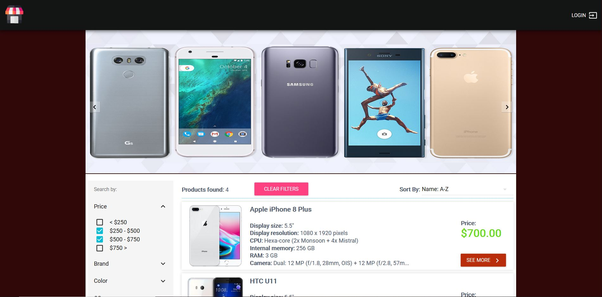

# MERN stack shopping cart



## Description
Ecommerce app built with MERN stack and using RESTful API design. Responsive front-end design done with Material-UI, Passport used for authentication, database hosted on mLab. Deployed on Heroku.

You can get and view the list of all products from the API, register, add products to cart, remove specific product or empty entire cart, make order...
Live demo on https://mern-ecommerce-ts-app.herokuapp.com/

## Technologies & Tools

### Front-end:

* React
* Redux
* Redux-Saga
* Material-UI
* Webpack
* Axios

### Backend:

* Node/Express
* MongoDB/Mongoose
* Passport
* StripeAPI

## Installation and Usage

### Requirements:

* Node.js installed
* MongoDB connection

### Steps:
1. Clone repo on your local machine:
```
git clone git@github.com:Da3az/mern-ecommerce.git
```
2. Install server-side dependencies:
```
$ npm install
```
3. Install client-side dependencies:
```
$ cd client
$ npm install
```
4. Create dotenv file and add your mongodb and stripe key
```
 .env>>><br>
 MONGODB_URI=yourKEY
 STRIPE_KEY=yourKEY
```

5. replace express-session secret on server.js on line 33
```
secret: privates.sessionSecret, --> to --> secret: <Insert your secret string here>,
```

6. Build the app:
```
$ npm run build
```
7. Execute the app:<br/>
```
$ cd ..
$ npm run start
```
8. App now running on ```localhost:5000```
